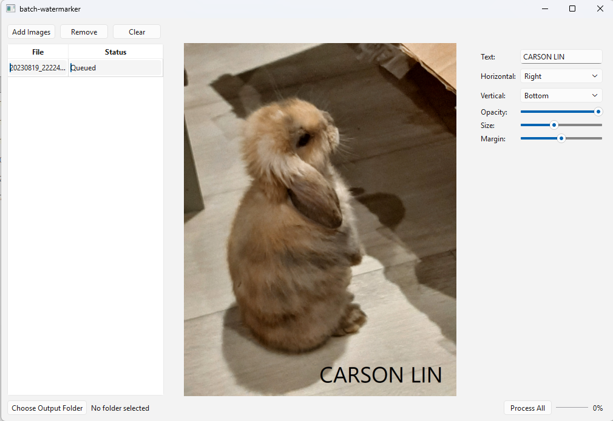

# Batch Watermarker

A desktop app written in C++ and Qt 6 that stamps a text watermark onto many photos at once. It has a live preview, per-file status tracking, and parallel batch export.



## Features

- Add multiple images (PNG, JPEG, BMP) and track each one in a table with a **Queued / Processing / Done / Failed** status
- Live preview of the selected image that updates as you change any setting
- Watermark settings: text, horizontal alignment (left / center / right), vertical alignment (top / center / bottom), opacity, size, and margin
- Choose an output folder and process the whole list with one click
- Parallel processing on all available CPU cores, with a live progress bar and a window that stays responsive
- Correct orientation for phone photos (EXIF rotation is applied when loading)
- Remove and Clear only affect the list. Your original files are never modified or deleted

Output files are named `<original name>_watermarked_<row>.<ext>` and written to the chosen folder.

## Performance

### Live preview

Every settings change re-applies the watermark. Instead of processing the full-resolution photo each time, the preview watermarks a copy scaled to 800 px wide.

| Image | Time per preview update |
|---|---|
| Full-resolution source (4032 x 3024) | ~8 ms |
| 800 px-wide preview copy | ~1 ms |

That is roughly an 8x reduction (measured in a Debug build). The preview copy has about 25x fewer pixels, but the speedup is smaller because some of the work (font setup, text measurement, painter setup) doesn't depend on image size.

### Batch export

Test set: 100 images at 4032 x 3024. Machine: 8-core CPU with 16 logical processors. The first run at each thread count was discarded, and the rest were averaged.

<!-- TODO: state whether the 100 images were copies of one photo or different photos, and whether the output folder was outside OneDrive. -->

| Threads | Runs (ms) | Average (ms) | Speedup vs 1 thread |
|---|---|---|---|
| 1 | 18,331 / 18,524 | 18,428 | 1.00x |
| 2 | 9,084 / 9,167 | 9,126 | 2.02x |
| 4 | 4,850 / 4,819 | 4,835 | 3.81x |
| 8 | 2,799 / 2,908 | 2,921 | 6.31x |
| 16 | 2,312 / 2,234 | 2,273 | 8.11x |

A plain single-threaded loop (no thread pool) averaged about **18.0 s** for the same 100 images. With the default pool size (16 threads here), the batch takes about **2.3 s**, roughly **7.9x faster**.

Scaling is close to linear up to 4 threads, bends at 8 (the number of physical cores), and the hyperthreads at 16 add a further ~29%. Likely contributors to the bend are disk writes, memory bandwidth, and lower per-core clocks under load, but I did not isolate which one dominates.

Debug and Release builds gave nearly identical batch times (~17.9 s each). Almost all of the time is spent inside Qt's own JPEG decode, encode, and painting code, which is already optimized, and very little is in this project's own code.

## How it works

### Watermarking

- `applyWatermark` converts a copy of the image to `ARGB32_Premultiplied` and draws the text with `QPainter`. The input image is never modified.
- Size and margin are fractions of the image width, so the same settings look proportionally the same on small and large photos.
- Alignment is computed from `QFontMetrics`. The horizontal choice decides where the text starts, and the vertical choice decides where its baseline sits, so the text keeps an even margin from the edges it is anchored to.

### Batch processing

1. On the GUI thread, `onProcessAll` builds one `ProcessJob` per row: source path, output path, and its own **copy** of the watermark settings.
2. `QtConcurrent::mapped` runs `processImage` (load, watermark, save) for each job on the global `QThreadPool`.
3. A `QFutureWatcher<bool>` delivers `resultReadyAt` and `finished` signals back on the GUI thread, where slots update the table's status column and the progress bar.

Worker threads never touch widgets or the model, so no locks are needed. Add, Remove, Clear, and Process All are disabled while a batch runs, so row numbers stay valid until every result is in.

### Model/View

`JobListModel` inherits from `QAbstractTableModel` and stores one job per row (file path and status). It announces changes with `beginInsertRows` / `endInsertRows`, `beginRemoveRows` / `endRemoveRows`, `beginResetModel` / `endResetModel`, and `dataChanged`, so the `QTableView` and the progress-bar reset stay in sync without polling.

## Project structure

```
batch-watermarker/
├── CMakeLists.txt
├── main.cpp
├── mainwindow.h / mainwindow.cpp    # window, layout, signal/slot wiring, batch control
└── core/
    ├── watermark.h / watermark.cpp  # applyWatermark, loadImage, processImage, settings
    └── joblistmodel.h / .cpp        # QAbstractTableModel for the file list
```

The watermarking code in `core/` has no dependency on any widget, so it can be reused or tested without a window.

## Building

Requirements:

- Qt 6.5 or newer, with the Core, Gui, Widgets, and Concurrent modules
- CMake 3.19 or newer
- A C++ compiler supported by your Qt kit

Developed and tested on Windows with Qt 6.11.2 (MinGW 64-bit) in Qt Creator.

**Qt Creator:** open `CMakeLists.txt`, select a Qt 6 desktop kit, and press Run.

**Command line:**

```
cmake -S . -B build -DCMAKE_PREFIX_PATH=<path to your Qt kit, e.g. C:/Qt/6.11.2/mingw_64>
cmake --build build
```

You may need to pass a generator (for example `-G "MinGW Makefiles"`) to match your Qt kit's compiler.

## Usage

1. Click **Add Images** and select one or more photos.
2. Click a row to preview it. Change the text, alignment, opacity, size, or margin and the preview updates immediately.
3. Click **Choose Output Folder** and pick where the results should go. Use a different folder from your originals.
4. Click **Process All**. Each row's status updates as its image finishes, and a summary appears at the end.

## Known limitations

- Watermark text is always white, and there is no font picker.
- Only text watermarks are supported (no logo images).
- Output files are saved with Qt's default JPEG quality, and other metadata such as EXIF camera and GPS data is not carried over.
- Output names include the row number, so running the same batch twice into the same folder overwrites the earlier results.
- Positions are relative to each image, so a watermark placed for a landscape photo lands in a different spot on a portrait photo.
- Tested on Windows only.
- No automated tests yet.

## Possible future work

- Color, font, and outline or shadow options, so the text stays readable on any background
- Logo (image) watermarks
- Configurable JPEG quality and output format
- Safer output naming that checks for existing files
- Cancel button for a running batch
- Unit tests for the watermark function and the job model
